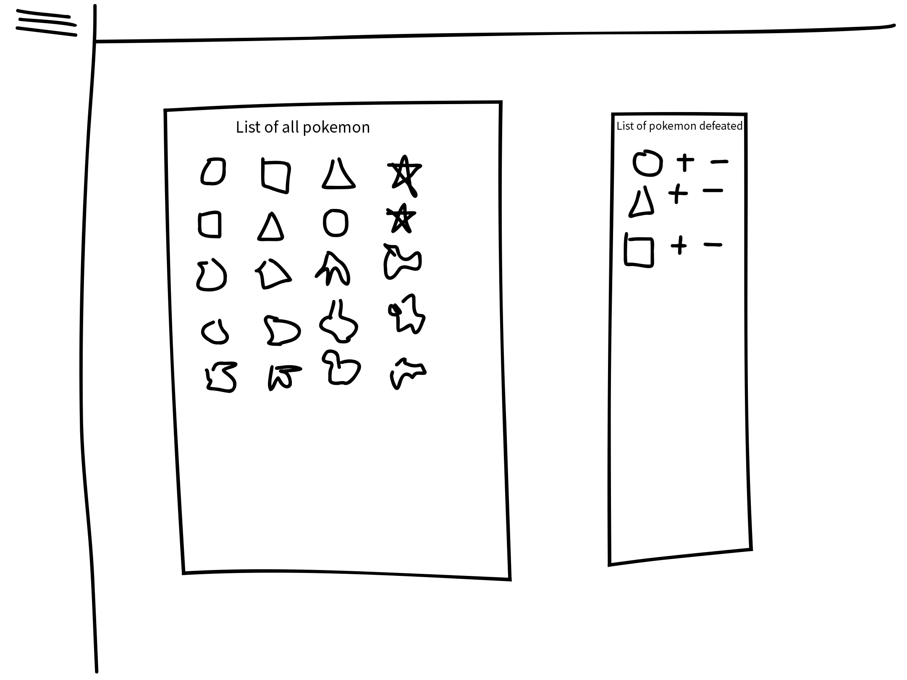

# Pokemon Battle Tracker

Have you ever wondered how many pidgey you had to demolish before getting to the first gym? How about the numer of rattatta you had to exterminate? Or maybe you just want to count the number of times you've been ambushed by a zubat while in a cave. The Pokemon Battle Tracker, or PBT for short, is here to help!

# Wireframes
Basic idea of how the app will look

# Trello

https://trello.com/invite/b/W3AwfASc/ATTI8b43243cde1a38b6737ebef6aad25d54ADC1D2E2/project-3

# pseudocode

- connect to PokeAPI
- set up components
    - previous encounters page
        - lists saved per session
        - list of all pokemon
        - list of defeated
    - current encounters
        - list of all pokemon
        - list of pokemon defeated with buttons for adding/subtracting
- set up models
- set up routes
- set up auth
- make pretty

